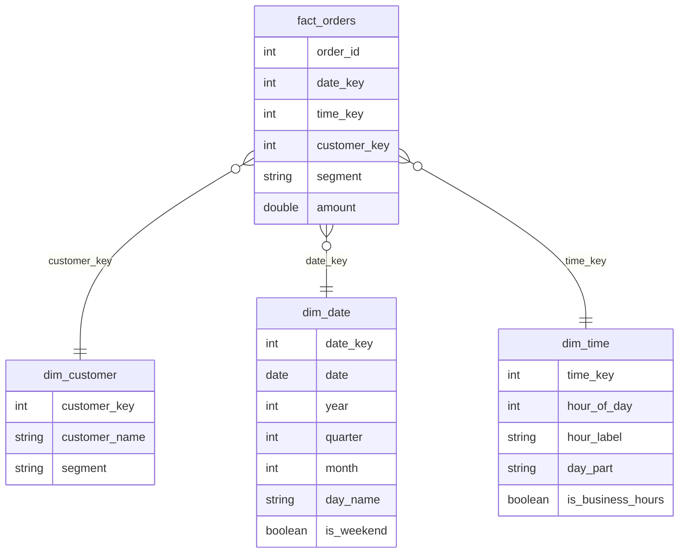
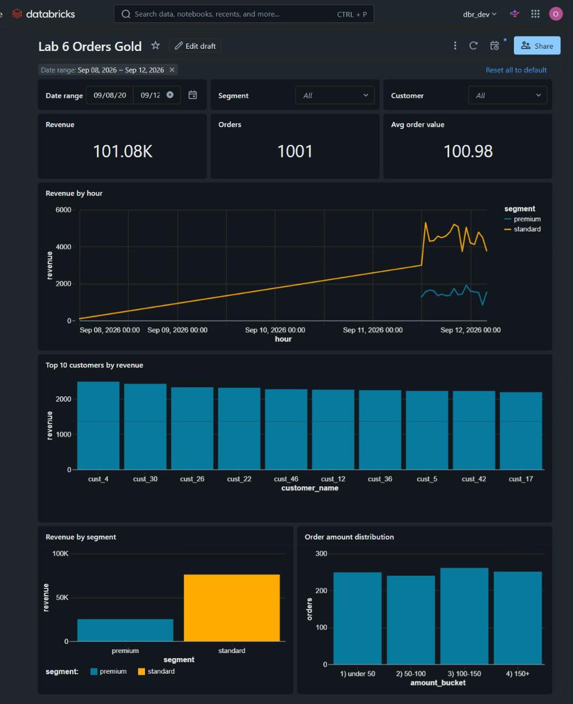
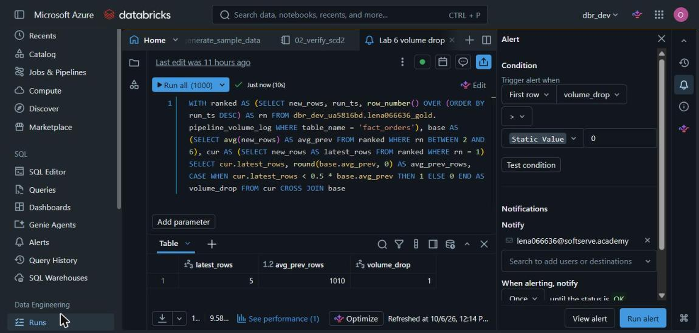
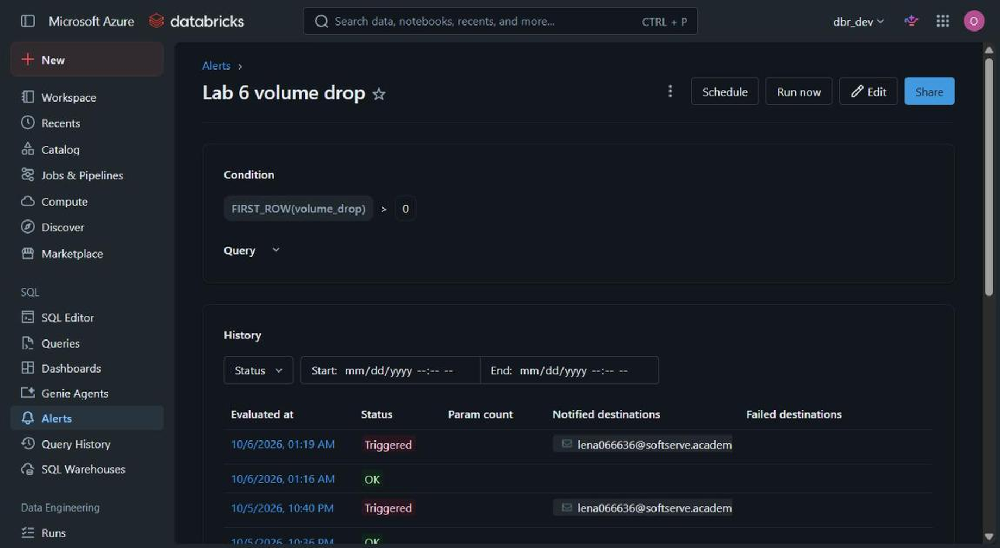
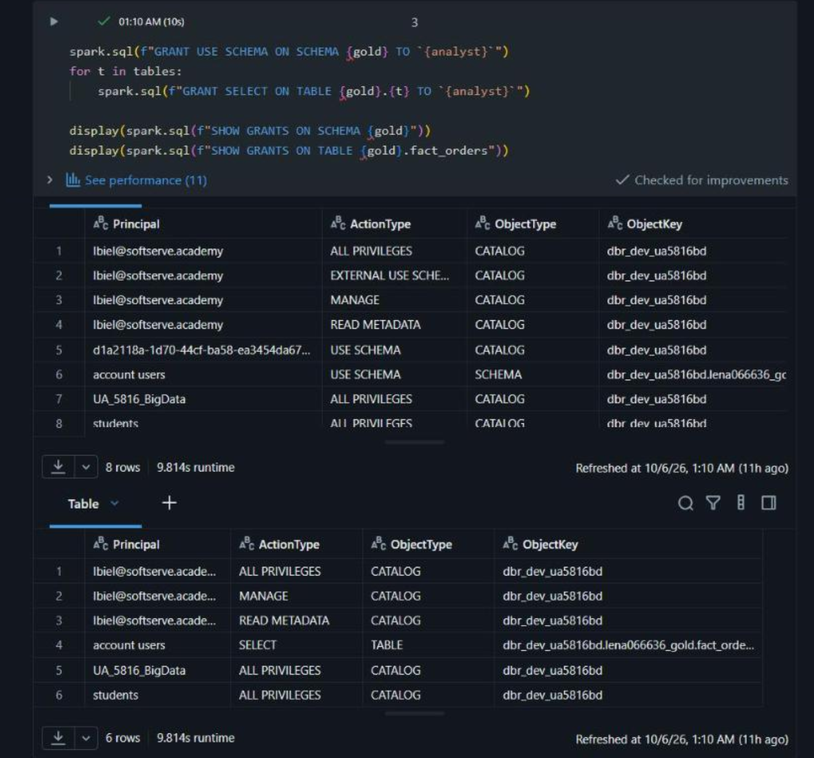
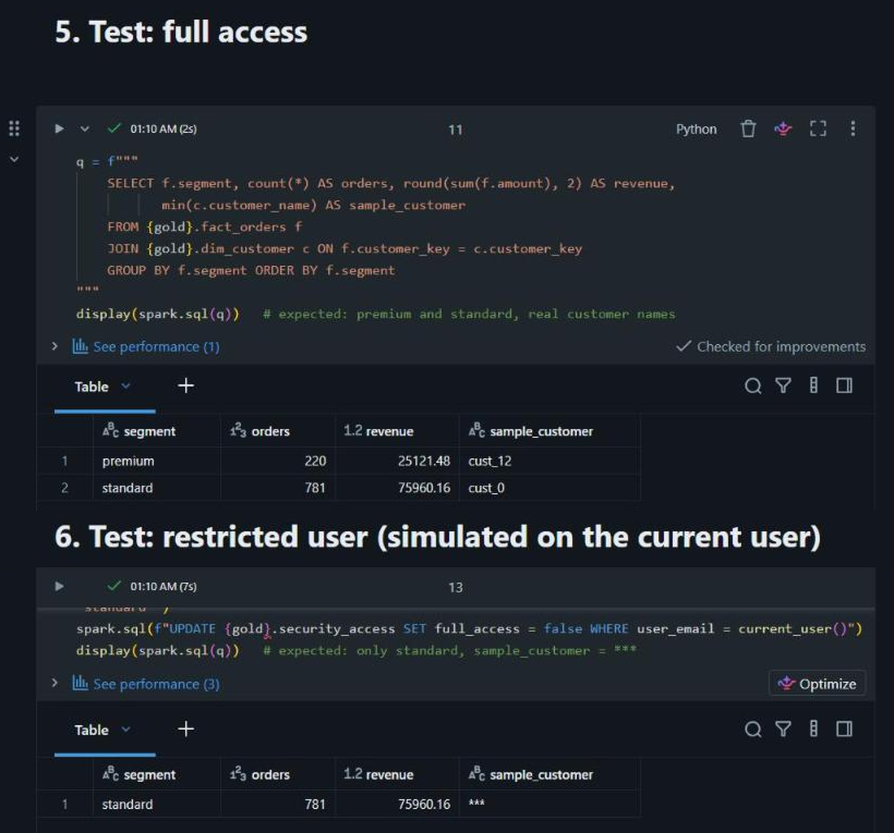

# Lab 6: Gold Layer and Business Analytics

## Overview

This project builds the gold layer on top of the silver orders table from the previous labs
and presents it from a business perspective. A star schema is built from the silver data, an
AI/BI dashboard with filters is built on the gold tables, an alert watches the data volume,
and access to the data is governed with object permissions, row-level security and
column-level security.

Catalog: `dbr_dev_ua5816bd`. Source: `lena066636_silver.orders`. Gold schema: `lena066636_gold`.

## Star schema

A star schema keeps measurements in one fact table and descriptive attributes in small
dimension tables. Queries join the fact to the dimensions they need, which keeps analytical
queries simple and fast.

The grain of `fact_orders` is one row per order, and the measure is `amount`. The order time
is stored as two keys: `date_key` and `time_key` (hour of the day). The exact timestamp is not
kept in the fact table. It has high cardinality and takes a lot of storage, and sales are
analyzed by day and hour, not by milliseconds. `dim_time` adds the day part (night, morning,
afternoon, evening) and a business-hours flag. The customer
segment (`premium` for the top 20% of customers by revenue, `standard` for the rest) is
derived in the dimension and also stored in the fact, so the row filter does not need a join.
Silver columns come from CSV files, so they are cast to proper types when the gold layer is
built.

Aggregations built from the fact table:

| Table | Content |
|---|---|
| `agg_daily_sales` | orders, revenue and average order value per day |
| `agg_hourly_sales` | orders and revenue per day and hour (`date_key`, `time_key`) |
| `agg_customer_sales` | orders, revenue and average order value per customer |

## Components

**`notebooks/00_static_dimensions.py`**: loads `dim_date` and `dim_time` once. `dim_date`
covers several years ahead (2024 to 2030 by default, set by widgets). Existing tables are
skipped unless `recreate = yes`, so the static dimensions are not rebuilt with the facts.

**`notebooks/00_seed_silver_orders.py`**: optional. Creates a sample silver orders table in a
workspace where the previous labs were not run, for example a trial workspace.

**`notebooks/01_build_gold.py`**: builds `dim_customer`, the fact table and the aggregations
from silver, adds table comments and validates the result (row counts and a check that no fact
row is missing a dimension). All names are widget parameters. Every table is rebuilt from
silver, so the notebook can be rerun safely.

**`sql/dashboard_datasets.sql`**: six datasets for the dashboard.

**`notebooks/02_governance_rls_cls.py`**: governance, described below.

**`notebooks/03_volume_monitor.py`**: logs how many new rows reached the fact table on each
run into `pipeline_volume_log`, and can simulate a normal baseline and a volume drop.

**`sql/alert_volume_drop.sql`**: the alert query.

## Dashboard

The AI/BI dashboard has the following widgets, all based on the gold tables:

- counters: revenue, number of orders, average order value
- line chart of revenue per hour, split by segment
- bar chart of revenue per day part
- bar chart of the top 10 customers by revenue
- bar chart of revenue per segment
- bar chart of the order amount distribution

Global filters: date range, customer segment and customer.

## Alert

The alert runs `sql/alert_volume_drop.sql`. It compares the number of new rows of the latest
load with the average of the five previous loads and returns `volume_drop = 1` when the latest
load is below 50% of that average. The alert triggers when `volume_drop > 0` and sends an
email notification.

The drop is simulated with `03_volume_monitor.py`: first a baseline of six normal loads, then
one load with almost no new rows.

## Governance

**Object permissions.** The analyst principal gets `USE SCHEMA` on the gold schema and
`SELECT` on the gold tables. No write privileges are granted.

**Row-level security.** A row filter (`rls_segment_filter`) is set on `fact_orders` for the
`segment` column. A user sees only orders of the segments listed for them in the
`security_access` table.

**Column-level security.** A column mask (`cls_mask_customer`) is set on
`dim_customer.customer_name`. Users without `full_access` in `security_access` see `***`
instead of the customer name.

**Verification.** The same query returns both segments with real customer names for a user
with full access, and only the standard segment with hidden names for a restricted user.

## Running in another workspace

1. Set the `catalog` widget (and schema names, if they differ) in every notebook.
2. If the silver orders table does not exist, run `00_seed_silver_orders`.
3. Run `00_static_dimensions`, then `01_build_gold`, `02_governance_rls_cls` and `03_volume_monitor`.
4. Create the dashboard from `sql/dashboard_datasets.sql` and the alert from `sql/alert_volume_drop.sql`.

Dashboards that use embedded credentials run with the permissions of the publisher, so row
filters and masks are evaluated for the publisher.
